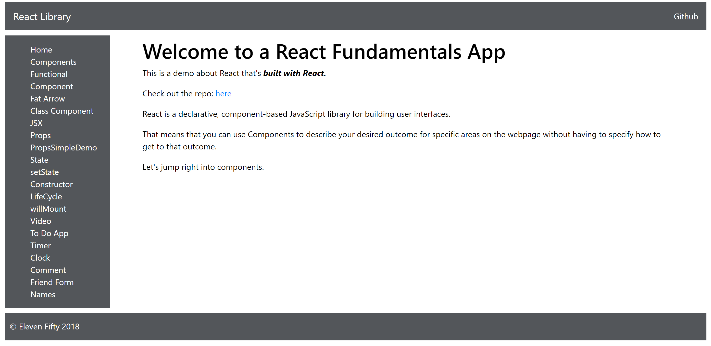

#Project Layout
1. Set up the layout of our tutorial site, including the routing for it using React Router.
2. We'll use a library called reactstrap for easy use of Bootstrap components in our project.
3. We'll set up our initial components for structuring the app.
4. We'll set up a small amount of styling for each of the components.

## react-router-dom
For our routing for this app, we'll add react-router-dom. To install this, run the following

```sh
npm install react-router-dom --save
```

You'll be setting up React Router momentarily, but in the mean time, you can read more about React Router [here](https://reacttraining.com/react-router/web/guides/quick-start). 


## reactstrap 
Again, React itself is a library, a single file that we use to make React components. There are hundreds of other libraries and tools that we can use in conjunction with a React application. [reactstrap](www.reactstrap.org) is a handy library for adding Bootstrap to our application. Let's get it started.

### install bootstrap 

Install bootstrap 
```sh
npm install bootstrap --save
```

Import bootstrap.css in App.js. Make sure it's above the App.css import.

```diff
    import React, { Component } from 'react';
+   import 'bootstrap/dist/css/bootstrap.css';
    import './App.css';
```

Now, let's install reactstrap by running the following command: 
```sh
npm install --save reactstrap@next
```

### File Additions
Let's add a few files and directories for the layout of our site. Please add the following to your components directory inside a site folder. With the exception of `_routes.js`, please make sure that your `.js` files are capitalized:

```
    └── src
        └── assets
        └── components
                └── site
                    └── _routes.js
                    └── Footer.js
                    └── Header.js
                    └── Home.js
                    └── Sidebar.js
        └── constants
        └── styles
              └── _body.scss
              └── _footer.scss
              └── _header.scss
              └── _main.scss
              └── _sidebar.scss
              └── _variables.scss
```


### React.js components
We're going to add some simple components for the layout of the project. Please go ahead and copy and paste the code at this point. Soon enough, you will write your own components, and we will talk about components in the next module. 

Add the following to `Header.js`:

```js
    import React, { Component } from 'react';
    import {
      Navbar,
      NavbarBrand,
      Nav,
      NavItem,
      NavLink,
    } from 'reactstrap';

    class Header extends Component {
      render() {
        return (
          <header>
            <Navbar className="header">
              <NavbarBrand href="/">React Library</NavbarBrand>
                <Nav className="ml-auto" navbar>
                  <NavItem>
                    <NavLink href="https://github.com/yourhandle/yourrepoforthisapp">Github</NavLink>
                  </NavItem>
                </Nav>
            </Navbar>
          </header>
        );
      }
    }

    export default Header;
``` 

Add the following code to `Footer.js`:

```js
    import React, { Component } from 'react';
    import {
        Row
      } from 'reactstrap';

      class Footer extends Component {
      render() {
        return (
          <footer>
            <Row>
              <p>&copy; Eleven Fifty 2018</p>
            </Row>
          </footer>
        )
      }
    }

    export default Footer;
``` 

Add the following to `Sidebar.js`:
```js
import React from 'react';

import {
  Route,
  Link
} from 'react-router-dom'

import { routes } from './_routes';

const Sidebar = () => (

  <div className="sidebar">
    <div className="sidebar-list-styling">
      <ul className="sidebar-list list-unstyled">
        <li><Link to="/">Home</Link></li>
        <li><Link to="/components">Components</Link></li>
        <li><Link to="/functionalcomponent">Functional Component</Link></li>
        <li><Link to="/fatarrow">Fat Arrow</Link></li>
        <li><Link to="/classcomponent">Class Component</Link></li>
        <li><Link to="/jsx">JSX</Link></li>
        <li><Link to="/props">Props</Link></li>
        <li><Link to="/propssimpledemo">PropsSimpleDemo</Link></li>
        <li><Link to="/state">State</Link></li>
        <li><Link to="/setstate">setState</Link></li>
        <li><Link to="/constructor">Constructor</Link></li>
        <li><Link to="/lifecycle">LifeCycle</Link></li>
        <li><Link to="/willmount">willMount</Link></li>
        <li><Link to="/video">Video</Link></li>
        <li><Link to="/todo">To Do App</Link></li>
        <li><Link to="/timer">Timer</Link></li>
        <li><Link to="/willmountadv">Clock</Link></li>
        <li><Link to="/comment">Comment</Link></li>
        <li><Link to="/friendform">Friend Form</Link></li>
        <li><Link to="/names">Names</Link></li>
      </ul>
    </div>
    <div>
      {routes.map((route, index) => (
        <Route
          key={index}
          path={route.path}
          exact={route.exact}
          component={route.main}
        />
      ))}
    </div>
  </div>
)

export default Sidebar;
```

Add the following to `Home.js`

```js
    import React from 'react';
    import { Component } from 'react';

    //landing page
    export default class Home extends Component {
      render(){

        return(
          <div className="main">
            <div className="mainDiv">
              <h1 className="section-title">Welcome to a React Fundamentals App</h1> 

              <p>This is a demo about React that's <strong><i>built with React.</i></strong></p>
              <p>Check out the repo: <a href="https://github.com/jpauloconnor/react-library" target="blank"><span>here</span></a></p>

              <p>React is a declarative, component-based JavaScript library for building 
              user interfaces.</p>
              <p>That means that you can use Components to describe your desired outcome 
              for specific areas on the webpage without having to specify how to get to 
              that outcome.</p>
              

              <p>Let's jump right into components.</p>
            </div>
          </div>
        );
      }
    }
```

Add the following to `_routes.js`

```js
    import React from 'react';
    import Home from './Home';

    export const routes = [
        {
        path: '/' || '/home',
        exact: true,
        sidebar: () => <div>Home</div>,
        main: () => <Home />
        }
    ]
```

### SCSS starter code for components
Next, we'll add some starter styling for each of our components:

Add the following code to `_header.scss`:
```scss
    /****************************
    Header Section
    ****************************/
    .header {
        margin-top: 0.5em!important;
        text-align: center;
        background-color: $gray; 
        color: white;
    }
    
    .header a {
        color: white;
    }

    .header  p {
        margin-top: 0.8em!important;
    }
```

Add the following code to `_footer.scss`:
```scss
    /****************************
    Footer Section
    ****************************/
    footer {
    background-color: $gray; 
    margin-top: 10px;
    }

    footer  p {
    margin-top: 0.8em!important;
    margin-left: 1.5em;
    }
```

Add the following code to `_sidebar.scss`:

```scss
    /****************************
    Sidebar Section
    ****************************/

    .sidebar {
        display: flex;
        background-color: $gray; 
        margin-top: 10px;
    }

    ul {
        list-style-type: 'none';
    }

    .sidebar-list-styling{
        padding-left: 50px;
        padding-top: 15px;
        width: 15%;
        background-color: $gray;
        color: white;
    }

    .sidebar-list a{
        color: white;
        padding: 0;
    }

    .sidebar-route{ 
        flex: 1;
        padding: '00px'; 
    }
```

Add the following code to `_main.scss`:
```scss
    /****************************
    Main Section
    ****************************/
    .main {
    background-color: white;
    color: black;
    height: 100%;
    min-height: 100%;
    }
    
    .mainDiv {
    margin: auto;
    width: 90%;
    padding: 5px;
    }
```

### Run the app

At this point, you should be able to run `npm start` and get the following:



[4 - Components](4-Components.md) 
