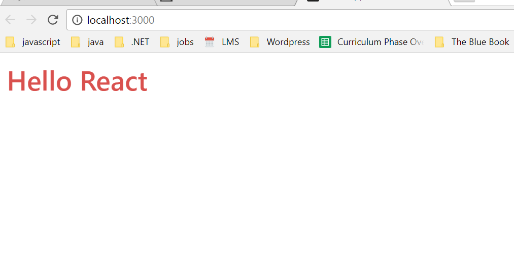

# Calling a Component
A Functional Component is essentially a function, so like a function, we need to call the function to use it. Most of the time, when you call an instance of a component, it will be called similarly to an HTML self-closing tag, and the call should generally be the same name as the component itself. So for instance, this component is called FunctionalComponentDemo, so we'll call it like this

`<FunctionalComponentDemo />`

### Where to call it?
Let's play around a little bit so that you can see how to call a component. 

1. Go to `App.js`.
2. Add an import for the Functional Component file. 
2. Remove the items inside the tags currently inside the div tag.
3. Add the call of the component `<FunctionalComponentDemo />`. 

```js

*****************************
Some Imports omitted
*****************************
+ import FunctionalComponentDemo from './components/concepts/1.0_FunctionalComponentDemo.js';
import Sidebar from './components/site/Sidebar'

class App extends Component {
  render() {
    return (
      <div>
        <FunctionalComponentDemo />
      </div>
    );
  }
}

export default App;
```

One more quick change:
1. In the scss files, go to `_body.scss`.
2. Change color: white to `color: $red`(just so we can see our text)

```css
/****************************
Body Section
****************************/
body {
    padding: 15px;
    color: $red;
    font: Belleza;
}
```
Run `npm start`. You should see the following:



## Quick Explanation

So what's happening here? 
1. We have the FunctionalComponentDemo component. 
2. It's being called in `App.js`. 
3. `App.js` is being called inside of index.js. 
4. `index.js` has a ReactDOM.render() method where `<App />` is passed in as a paramter.
4. index.js is reaching out to the root in the index.html file where it is being rendered. 

Notice how there is a sort of flow to the data here. It goes through a channel where it eventually finds the HTML. The FCDemo component is a child of the App component. The App component is a child of index, and index This unidirectional flow is what people love about React. 
Rule: Data flows in one direction in React. 
 


When you run the app, it should look like this:


Let's take the app back to where it was. You'll need to change the `App.js` file and the `_body.scss` file back by hitting `ctrl + z`. It should do it even if you have saved, if not here is the `App.js file` for your convenience:

```js
import React, { Component } from 'react';
import 'bootstrap/dist/css/bootstrap.css';
import './App.css';
import Header from './components/site/Header'
import Footer from './components/site/Footer'
import Sidebar from './components/site/Sidebar'
import {
  BrowserRouter as Router,
} from 'react-router-dom';

class App extends Component {
  render() {
    return (
      <div>
        <Header />
        <Router>
          <Sidebar />
        </Router>
        <Footer />
      </div>
    );
  }
}

export default App;
``` 


#### _route.js or where to really call it
With our current routing, to get the component firing properly we need to call the components in our `_routes.js` file. To call this, we'll need to have it in our `routes.js` file. 

```js
import React from 'react';
import Home from './Home';
import FunctionalComponentDemo from '../concepts/FunctionalComponentDemo'
import Resources from './Resources';

export const routes = [
    {
      path: '/' || '/home',
      exact: true,
      main: () => <Home />
    },
    {
      path: '/functionalcomponent',
      exact: true,
      main: () => <FunctionalComponentDemo />
    },
```
Notice that we're adding it as an import. Then, we're also adding a path, `/functionalcomponent`. When we go to that path it will fire the component. Simple. We'll learn more about the `=>` in a future module. For now, now that when we go to that path, we're firing off a function that runs the FunctionalComponentDemo.

#### Sidebar
We'll also want to add the path in our `Sidebar.js` file:

```js
import React from 'react';

import {
  Route,
  Link
} from 'react-router-dom'

import { routes } from './_routes';

const Sidebar = () => (

  <div className="sidebar">
    <div className="sidebar-list-styling">
      <ul className="sidebar-list list-unstyled">
        <li><Link to="/">Home</Link></li>
        <li><Link to="/rationale">Rationale</Link></li>
  +     <li><Link to="/functionalcomponent">Functional Component</Link></li>
        <li><Link to="/resources">Resources</Link></li>

      </ul>
    </div>
)

export default Sidebar;
```

Here we use React Router's Link Component to find our route when we click on the Functional Component text in the Sidebar. After we study React a little more, we can do a deeper dive into how this working. For now, it's best to just know that we will follow this pattern as we add more components. 

##Styling
Let's add the div class that we have for simple styling: 

```js
import React from 'react';

const FunctionalComponentDemo = function () {
    return (
+        <div className="main">
+            <div className="mainDiv">
                Hello React
+            </div>
+        </div>
    );
};

export default FunctionalComponentDemo;

```

At this point your app should look like this:


Let's take a look at the next module.