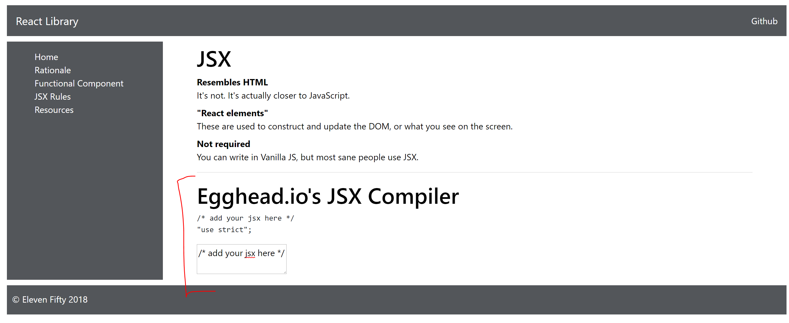

# JSX Compiler

Let's build our own JSX compiler, like the one that you just used at `Babeljs.io`. Please note that this entire component is taken from one of the best React fundamental courses online: [Egghead.io](https://egghead.io/lessons/react-build-a-jsx-live-compiler-as-a-react-component). It's totally free. 

Where the last module was a review challenge, this module will have you anticipating some big topics to come, including Class Components, State, constructors, and several other concepts.  You'll see code here that you won't understand until after we work through a lot more modules, but it's still fun to go play around with to get a big picture idea of the power of React. Also, as you start to write components we can have a handy built in compiler to play around with. 

### Getting started
Here's what you need to do to add your built in babeljs.io-style compiler:

1. In your components folder, create a file called `JSXCompiler.js`.
2. In that file, go ahead and add the following code. You have two choices for approaching: 
        * Copy and paste and read through the code a few times
        * Type it in and read as you type. 

3. Either way, do more than just copy and paste here.
4. Once you get the code added, read through it again and try to decipher what is happening. Realize that you are probably not going to understand at this point. However, get outside of your comfort zone and familiarize yourself with some of the vocabulary that you're going to see in a React application.  We'll start to talk about what it means in our ClassComponent & State modules.

Here is the code for the `JSXCompiler` file:

```js
// Source: https://jsbin.com/qonaga/edit?js,output

import React from 'react';

class JSXCompiler extends React.Component {
    constructor() {
        super();
        this.state = {
            input: '/* add your jsx here */',
            output: '',
            err: ''
        }
    }
    update(e) {
        let code = e.target.value;
        try {
            this.setState({
                output: window.Babel
                    .transform(code, { presets: ['es2015', 'react'] })
                    .code,
                err: ''
            })
        }
        catch (err) {
            this.setState({ err: err.message })
        }
    }
    render() {
        return (
            <div>
                <header className="compiler-header">{this.state.err}</header>
                <div className="compiler-container">
                    <pre>
                        {this.state.output}
                    </pre>
                    <textarea
                        onChange={this.update.bind(this)}
                        defaultValue={this.state.input} />
                </div>
            </div>
        )
    }
}

export default JSXCompiler;

```

###Add Babel & Behave
You'll need to add a few things to your `index.html` file for the compiler to run. The file is in your `public` directory. We'll stay out of the weeds and just say that these are scripts that help make this compilation happen. Notice that the cdn link is for `babel.min.js`.

Here's the code:

```html

    <!--Previous code omitted for brevity-->
    <div id="root"></div>

    <!--These additions must go under the "root"-->
    <script src="https://cdnjs.cloudflare.com/ajax/libs/babel-standalone/6.18.1/babel.min.js"></script>
    <script src="index.js"></script>
    <script src="//cdn.jsdelivr.net/behave.js/0.1/behave.js"></script>
    <script>
    var editor = new Behave({
      textarea:document.querySelector('textarea'),
      replaceTab:     true,
      softTabs:       true,
      tabSize:        2,
      autoOpen:       true,
      overwrite:      true,
      autoStrip:      true,
      autoIndent:     true
    });
    </script>
```

###Call the Component

The component won't run quite yet. You need to call it in the JSXRules file. Try not to look ahead. This is something you know how to do:

* Try to call the component in the JSXRules component.

(*Spoiler below*)


```js
    import React from 'react';
+   import JSXCompiler from '../JSXCompiler'

    const JSXRules = () => {
        return(
            <div className="main">
                <div className="mainDiv">
                    <h1 className="section-title">JSX</h1> 
                    <dl>
                        <dt>Resembles HTML</dt>
                        <dd>It's not. It's actually closer to JavaScript.</dd>
                        <dt>"React elements"</dt>
                        <dd>These are used to construct and update the DOM, or what you see on the screen.</dd>
                        <dt>Not required</dt>
                        <dd>You can write in Vanilla JS, but most sane people use JSX.</dd>
                    </dl>
+                   <hr />
+                   <h1>Egghead.io's JSX Compiler</h1>
+                   <JSXCompiler />
                </div>
            </div>
        );
    }

    export default JSXRules;
    
```

You can now run the app. It should look like this:




### Add some starter SCSS

Let's style the compiler a little. As always, eventually you'll want to take your own direction with the styling. Set up a separate SCSS called `_compiler.scss` in the same folder as the other SCSS files.

```scss
/****************
JSX COMPILER
****************/
  .compiler-header {
    display: block;
    height: 5vh;
    overflow: auto;
    background-color:$yellow;
    color:$red;
    font-size: 28px
  }
  
  .compiler-container {
    height: 95vh;
    display:flex;
  }
  
  pre {
    background-color: #f8f8f8;
  }
  
  pre, textarea {
    height: 95vh;
    width: 50%;
    font-family: monospace;
    font-size: 18px;
    margin: 0;
    padding: 10px;
    color: #222;
  }
  
  textarea:focus {outline: 0;}
  
```

You'll also need to add this to the imports in `App.scss`:

```scss
    @import "styles/variables.scss";
    @import "styles/body.scss";
    @import "styles/header.scss";
    @import "styles/sidebar.scss";
    @import "styles/main.scss";
    @import "styles/footer.scss";
+   @import "styles/compiler.scss";

```

### Babel.js
One paragraph doesn't seem like justice for one of the most important tools in all of this: Babel, which we've added for this component. [Here](https://codemix.com/blog/why-babel-matters/) is a great read for this enormously popular and important tool. What does Babel do for us? In the article you'll find a lot of information about how Babel transpiles ES7 and ES6 to ES5. Essentially, Babel lets you use all of the newest features of the newest versions of JavaScript (*like ES7*) without sacrificing backwards compatibility for older browsers. It translates new concepts for older browsers. It also has awesome support for dozens of different build & test systems. Be aware that sometimes you'll need to configure Babel & Webpack for a project, but that is outside of our current objective of learning about React. 


Also, let us remind you that this code is originally from Egghead.io. Check out the lessons there for more information. 