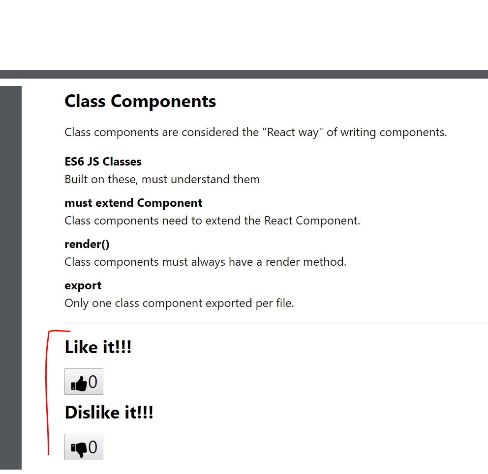

# 5.3: Class Components Challenge

Part 1: See if you can add a dislike button that is independent of the like button and has it's own counter that goes into negative numbers.

Part 2: Use the react-icons npm package that is already installed to create icons in the app. At the end it would look like this.... HINT: for react-icons, note that we are using a version 2 of the package. So when you look up react-icons documentation make sure you are checking out the docs for version 2. OR you can update your `package.json` to include the newest version, and then look at the most up to date docs. To update your `package.json` change the number, then run `npm update` in your terminal.

## Class Components

Class Components have a little more complexity than Functional Components. Let's stay with our pattern and make a little list of notes here.

* Must extend React.Component.
* Must always have a render method.
* Will often have a `constructor`.
* Class components are considered the "React way" of writing components.
* Known as intelligent components.
* Built with ES6 JS Classes.
* Have lifecycle hooks/methods, different phases in the lifecycle of the component where different events can/should happen.
* Use export, like Functional Components.
* Multiple class components can be in one file, but only one class component should be exported for each file.

These are a few rules that we'll study in the upcoming modules.

