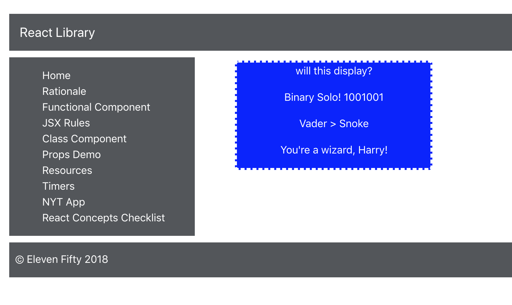
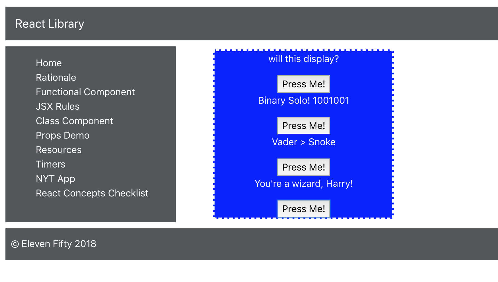

# 6.3: Props Passing Functions

Props are capable of passing so much more than simple strings!  Props can pass from parent component to child component strings, objects, arrays, functions, and even JSX.  Over the next 2 pages we're going to add state to our class component, build out 4 methods, and pass those methods to our functional component.  We'll see that these methods can be triggered from outside the class where they're built.

Inside the `PropsDemo` component, let's add a constructor to initialize our state:
```javascript
constructor(){
    super();
    this.state = {
        color: 'white',
        backgroundColor: 'blue',
        borderRadius: '5px',
        borderStyle: 'dashed',
        display: 'inline-block',
        width: '300px',
        textAlign: 'center'
    }
}
```

This state object is storing style properties that will show up within our parent class component.  We'll see these used next.  Let's add a new div around our 4 `FunctionalComp` calls.  This div will display our style options.  Your updated render should look as follows:

```javascript
render(){
    return(
        <div className="main">
            <div className="mainDiv">
                <div style={this.state}>
                    <FunctionalComp string="will this display?"/>
                    <FunctionalComp string="Binary Solo! 1001001"/>
                    <FunctionalComp string="Vader > Snoke"/>
                    <FunctionalComp string="You're a wizard, Harry!"/>
                </div>
            </div>
        </div>
    )
}
```

You should be seeing the following display:



Great!  We can see that our state object is being used to control the `style` attribute of the div inside our render.  In our class component, let's go ahead and build out a method that will let us control the style we see.  We'll pass this method to `FunctionalComp` and use them when we click a button.  It'll be cool!

Let's add the following code inside our `PropsDemo` class between the constructor and the render:

```javascript
    colorToggle = () => {
        this.setState({
            color: this.state.color === 'white' ? 'red' : 'white'
        })
    }
```

Notice again that we're using an ES6 arrow function to build out our method.  The arrow function makes sure that the `this` keyword in our method body refers to the class object, rather than the `FunctionalComp` body where it will be used.  Let's pass that function down to the child!  Update your `FunctionalComp` calls inside render to look like the following:

```javascript
    <FunctionalComp string="will this display?" function={this.colorToggle}/>
    <FunctionalComp string="Binary Solo! 1001001" function={this.colorToggle}/>
    <FunctionalComp string="Vader > Snoke" function={this.colorToggle}/>
    <FunctionalComp string="You're a wizard, Harry!" function={this.colorToggle}/>
```

Finally, let's use that function within our child component.  Let's update the `return` inside our `FunctionalComp` to look as follows:

```javascript
<div>
    <p>{props.string}</p>
    <button onClick={props.function}>Press Me!</button>
</div>
```

You should see the following output, with all 4 buttons being able to control the color of the text/border:



So what's happening?  We build out a method (function) in our class component.  All it's responsible for is setting the state of our class component.  However, this method doesn't get used in the class component.  We define a new prop called `function`, and this prop passes down our function to `FunctionalComp`.  The button we build out in `FunctionalComp` has an `onClick` event handler that fires our `colorToggle` method when it's clicked.  Thus, the child component is indirectly affecting the state of our parent component!  Pretty cool!

Your challenge to complete for the next page is to do the following--build out 3 more methods within `PropsDemo` that control `backgroundColor`, `borderRadius`, and `borderStyle`.  Each method should toggle something about these style properties in some way.  Pass these methods down as separate `function` props to the bottom 3 `FunctionalComp` calls inside of render.  The end result is that each button will control something different about the DOM!