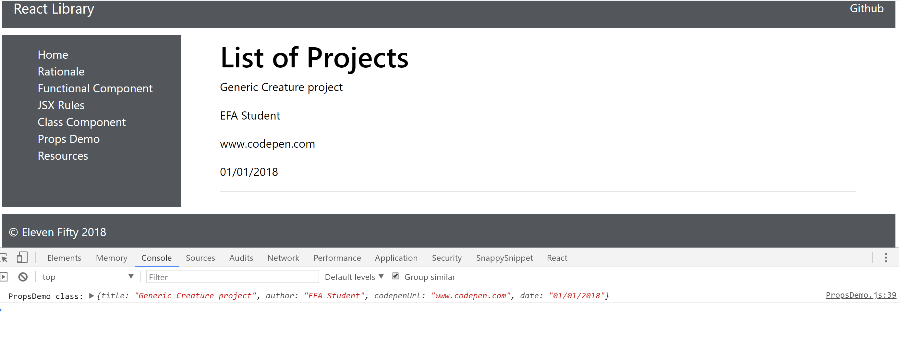
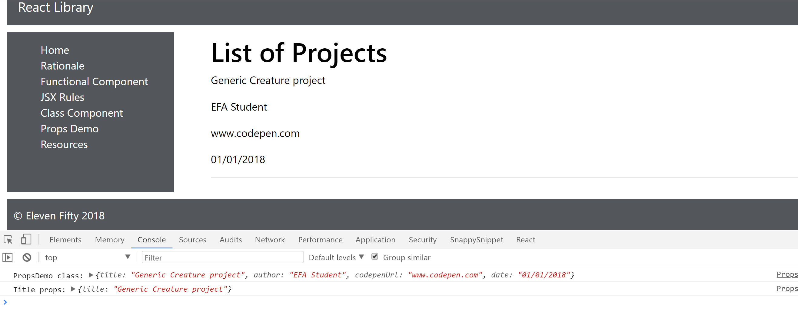
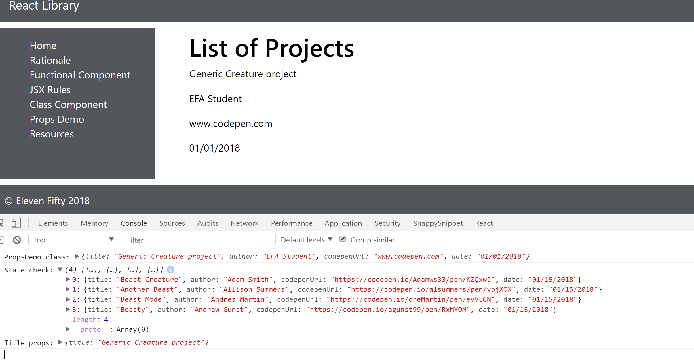
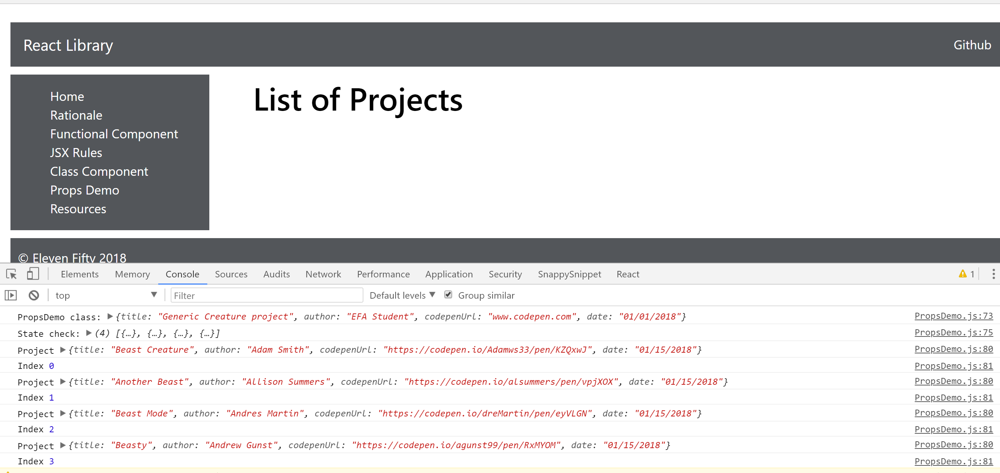
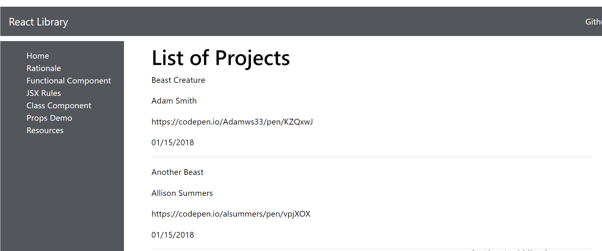
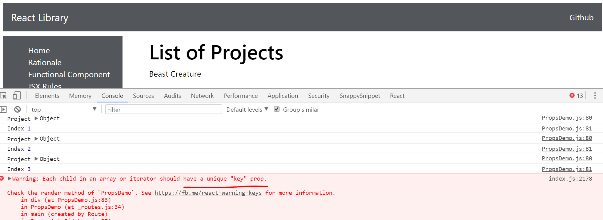
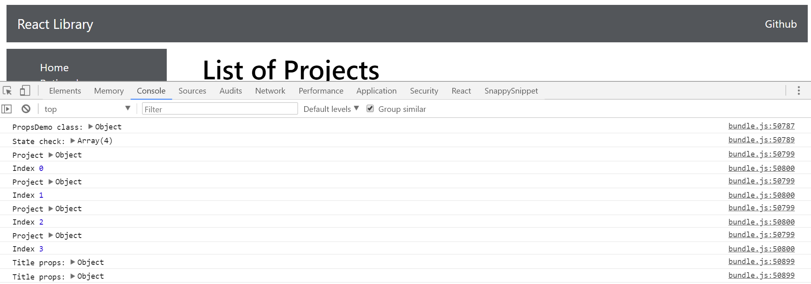

# 6.6: Props Map

Being able to call props on multiple instances of components is a very nice feature of React. However, what if we have an enormously large data set. Say 1000 student creature projects? In that case, React integrates with the JavaScripts `.map()` function in a very powerful and understandable way. It takes some study practice, but once you work through it, it's sharp! Let's play around with `.map()`.

## The Data

Let's start by moving all of our data to a `Projects` array. It's an array of objects, and we'll put it right under the imports for now:

```javascript
import React, { Component } from 'react';
import PropTypes from 'prop-types';

export const Projects = [
    { title: 'Beast Creature', author: 'Adam Smith', codepenUrl: 'https://codepen.io/Adamws33/pen/KZQxwJ', date: '01/15/2018' },
    { title: 'Another Beast', author: 'Allison Summers', codepenUrl: 'https://codepen.io/alsummers/pen/vpjXOX', date: '01/15/2018' },
    { title: 'Beast Mode', author: 'Andres Martin', codepenUrl: 'https://codepen.io/dreMartin/pen/eyVLGN', date: '01/15/2018' },
    { title: 'Beasty', author: 'Andrew Gunst', codepenUrl: 'https://codepen.io/agunst99/pen/RxMYOM', date: '01/15/2018' },
]
```

It's important to note that this array is currently just an array. The component has no idea what it is. The properties in the array of objects are not mapped together with the props in our components. They simply have the same name. We have to work our way towards mapping this array to our component.

## PropsDemo props values

The only thing we'll need to refactor is our `PropsDemo` component. Let's start by tearing out the values that have been placed in the component calls:

```jsx
return (
            <div className="main">
                <div className="mainDiv">
                    <h1>List of Projects</h1>
                    <div>
                        <Title />
                        <Author />
                        <CodepenUrl />
                        <Footer />
                        <hr />
                    </div>
                </div>
            </div>
        )
```

Now, we need to add a few things that we talked about in our last module on Class Constructors: `state`, `super`, `map()` and `constructors`.

We'll start with `constructor`:

```javascript
export default class PropsDemo extends Component {
    constructor(props) {
        super(props)
        console.log(props);
    }
```

Go ahead and run the app at this point. You shouldn't see anything, but if you inspect the app in the console, you should see the props coming in.


## Passing the props down

So we are able to have the props value in the constructor because we are still pulling it in from our defaultProps. Let's pass that `prop` value down to the components. Here's how to do that:

```javascript
        return (
            <div className="main">
                <div className="mainDiv">
                    <h1>List of Projects</h1>
                    <div>
                        <Title title={this.props.title}/>
                        <Author author={this.props.author} />
                        <CodepenUrl codepenUrl={this.props.codepenUrl}/>
                        <Footer date={this.props.date} />
                        <hr />
                    </div>
                </div>
            </div>
        )
```

When you run the app, you should get the default prop values on the screen:



## Passing them down even more

Just for understanding, let's see even more how these props get passed down to the 4 separate child components. Go into the `Title` component and add a constructor:

```javascript
class Title extends Component {
    constructor(props) {
        super(props)
        console.log("Title props:", props);
    }
    render() {
        return (
            <p> {this.props.title} </p>
        );
    }
}
```



Notice that the `Title` component `console.log` fires off second. The props are flowing uni-directionally from their original creation which is in the defaults. Then, they flow through the props constructor. Then, they flow down into the return of the `PropsDemo` component. Since the `Title` compoonent is a child of that `PropsDemo`, we pass `this.props.title` down as the value once again. Then, the `Title` component fires off and renders the value of the title property.

Kind of confusing, right? You'll learn best by studying your console.log statements here.

A valuable, but not required, exercise is to repeat this with the other 3 child components. It will be much easier if you understand this now, rather than later.

## Accessing the data

It gets more complex here again, but let's just keep stepping through. Our goal is to access the data in the array. We start to do this by accessing the state of the array and pulling the `Projects` array into the component. We do that by setting an initial state value:

```javascript
export default class PropsDemo extends Component {
    constructor(props) {
        super(props)
        console.log("PropsDemo class:", props);
        this.state = { projects: Projects };
        console.log("State check:", this.state.projects);
    }
```

Notice with that additional 'State Check' log, that `this.state.projects` is now a container object for all of the four objects in the array. We are going to pass that state down in the component.



## the map function

We can now use the expression `this.state.projects` to access our data using a `.map()` function. We suggest that you make sure to push the return of the render function down a few lines because the `.map()` function will have it's own `return`. Be careful of the syntax here. Start with this:

```javascript
    render() {
        const works = this.state.projects.map(() => {
        })

        *PUT TEMP SPACER HERE FOR CLARITY*
        return (
            <div className="main">
            *SOME CODE OMITTED*
            </div>
        )
    }
}
```

## Parameters

Then, we can add parameters to the `.map()` function itself. Remember that this is going to loop for us and map the array to our props. We'll need a placeholder parameter name that can be named anything we want. Usually, it's best to name it the singular version of the collection. We have `projects`. A good name would be `project` because each time it iterates, it's going to grab a single project.

We also should use a variable for indexing each item for the DOM\(more on that in discussion later\). Let's also throw in a `console.log` to see it running. Put it above the return in the `map()` function.

Last thing, for now, add some placeholder text in the return. See all of the code below:

```javascript
    render() {
        const works = this.state.projects.map((project, i) => {
            console.log("Project", project);
            console.log("Index", i);
            return (
                <h1>Hey Kenn! </h1>
            );
        })

        *RETURN OMITTED HERE FOR CLARITY*
```

When we run the app with this additional code, we should get a few console messages with each item in the array:



If you didn't get that, something went wrong.

## Rendering to the DOM

Once we are iterating, we can then start to pull in our instances of our components and render the data to the DOM. Here's what you'll need: 1. a key property that holds the index variable, `i`. 2. The `project` parameter to access the props.

See the code inside of the return below:

```jsx
        render() {
        const works = this.state.projects.map((project, i) => {
            console.log("Project", project);
            console.log("Index", i);
            return (
                <div> 
                    <Title key={i} title={project.title} />
                    <Author key={i} author={project.author} />
                    <CodepenUrl key={i} codepenUrl={project.codepenUrl} />
                    <Footer key={i} date={project.date} />
                    <hr />
                </div>
            );
        })

        return (
```

You also need to add the `works` variable into the return statement of the `render` function. With some interpolation, here's how we do that:

```jsx
        return (
            <div className="main">
                <div className="mainDiv">
                    <h1>List of Projects</h1>
                    <div>

                        {works}

                    </div>
                </div>
            </div>
        )
    }
}
```

Now, when you run you should see the data in the view:



## One problem

We do have a problem though.



React's virtual DOM requires that we have one index per element, and we're making four elements for each object. Right now, we have four indices with '1' as the value, four with '2', and so on. So we actually need to put the index on the parent div and not on each individual component, like this:

```jsx
    const works = this.state.projects.map((project, i) => {
            console.log("Project", project);
            console.log("Index", i);
            return (
                <div key={i}> 
                    <Title title={project.title} />
                    <Author author={project.author} />
                    <CodepenUrl codepenUrl={project.codepenUrl} />
                    <Footer date={project.date} />
                    <hr />
                </div>
            );
        })
```

You should now be mapping over the array. Great work!!! 



