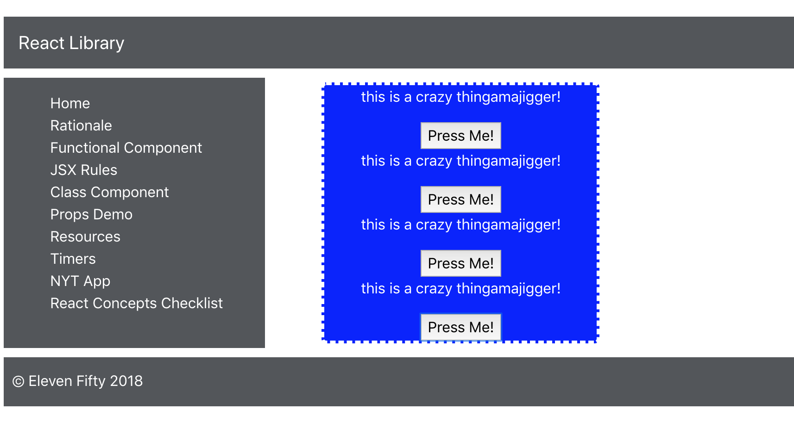
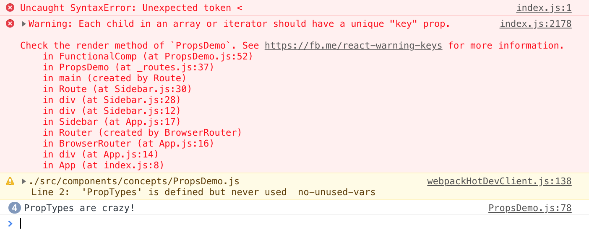
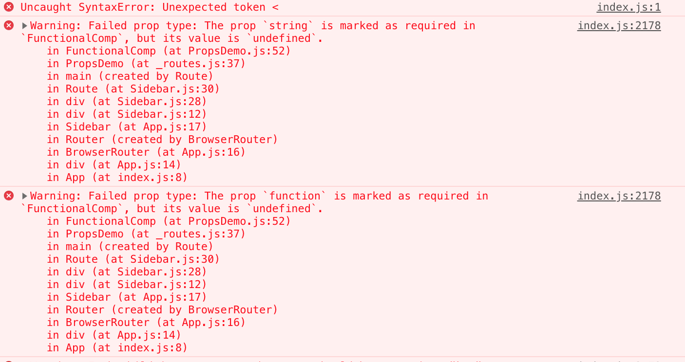

# 6.6: PropTypes

React has built into the environment access to something called `PropTypes`.  PropTypes provide an interesting function for React components.  First, they let you control exactly the type of prop passed between components.  For instance, our `FunctionalComp` has props passed to it that we're expecting are strings and functions.  If you have developed the `FunctionalComp` component, you will probably know that the `string` and `function` props are supposed to be a string and function, respectively.  However, if you come back to this project months later, or if a collaborator is working on this project with you, they may not know the type of data that should be passed through these props.  `PropTypes` will insure that anyone using this `FunctionalComp` component can't pass the wrong 'type' of data to it.

Second, `PropTypes` can also provide default values for props if values are failed to be passed to the component.  This can both save time if you're going to pass the same type of value over and over, and it can also make sure your component doesn't just flatout break when props are forgotten.  Let's investigate these 2 cases below.

Let's begin by importing `PropTypes` into our `PropsDemo.js` file.  Let's add it directly below the line 1 React import.

```javascript
import PropTypes from 'prop-types';
```

Next, let's go ahead and add some default props to the bottom of our file.  These will be default props for our `FunctionalComp` component:

```javascript
FunctionalComp.defaultProps = {
    string: 'this is a crazy thingamajigger!',
    function: () => console.log('PropTypes are crazy!')
}
```

Once you view your page, nothing will have changed.  Do you know why?  DefaultProps exist for when props are not provided.  However, we're still specifying our props from inside the .map within our render!  Let's comment out the `string` and `function` props and see what our page becomes!

If you view your work in Chrome, you should see the following display:



You'll probably notice that the buttons are no longer controlling the DOM as they were before.  That's because while our `string` default prop refers to the value `this is a crazy thingamajigger!`, the `function` prop refers to the arrow function which logs to the console.  If you click your buttons a few times, you should see something like the following in your console:



So we've seen what `defaultProps` can do for us, let's now check out `PropTypes`.  Let's add the following code below our defaultProps block:

```javascript
FunctionalComp.propTypes = {
    string: PropTypes.string.isRequired,
    function: PropTypes.func.isRequired
}
```

First, you should see that your `PropTypes` import is now being used in line 2.  If you comment out your `defaultProps` section and view your app, you should see the following in the console:



React is kind enough to throw a warning because your string and function prop types have been omitted, and it's looking for them.  You can imagine how including `PropTypes` in this way will help other developers unfamiliar with the components you're building out to be aware and use your code correctly!

Let's go ahead and un-comment the `string` and `function` props.  Your app should now be working like normal again, with all of the buttons triggering different features of the DOM, and each `<p>` specifying what the button does.

If you're interested in learning more about PropTypes, you should check out the official docs on PropTypes here:

https://reactjs.org/docs/typechecking-with-proptypes.html