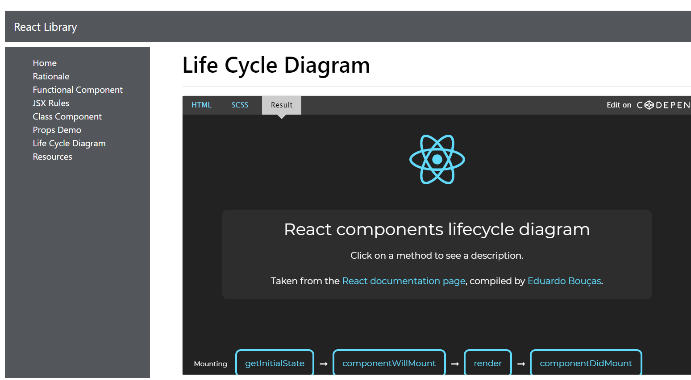

# 7.1: Lifecycle Methods

The React development team provides a bunch of methods to interact with the a component's life cycle. These methods let us utilize certain parts of the life cycle, to develop more efficiently. Each of the life cycle methods are called in a specific order and at a specific time. We'll go through each life cycle phase, and highlight the important to know lifecycle methods.

## Mounting Phase

* `constructor()`
* `render()`
* `componentDidMount()`

## Update Phase

* `shouldComponentUpdate()`
* `render()`
* `componentDidUpdate()`

## Death / Unmount

* `componentWillUnmount()`

The order of these methods are strict and called as defined above. Most of the time is spent in the Growth/Update phase and those methods are called many times. The Birth and Death methods will only be called once.

These methods happen every time in the above order. Some of them are more commonly interacted with than others, so we'll continue to hone in on the ones that are most important when developing.

Note that the ones you will commonly use and see will be marked with a `*` by their names.

### Please Note
In older code, in your React research, and in general you may see references to `componentWillMount()`, `componentWillReceiveProps()`, or `componentWillUpdate()`. These are now considered legacy and should be avoided going forward. For more information see the docs [here](https://reactjs.org/docs/react-component.html#mounting).

## Challenge

In the concepts folder create a component called `LifeCycleCodepen.js`.

In the component add an embedded view of the following Codepen. To do this do not use the `react-codepen` package \(it has issues with current versions of react\), but instead check out the package, and take inspiration from the package and try to utilize iframes like the package does to display the codepen.

[https://codepen.io/ccharris/pen/wxdKYa](https://codepen.io/ccharris/pen/wxdKYa)

This is a nice looking diagram of the Lifecycle methods. Add a route and Sidebar link called /lifecyclediagram and Life Cycle Diagram, respectively.

The route should look like this:

[Mounting Methods](7.2-mounting-methods.md)

