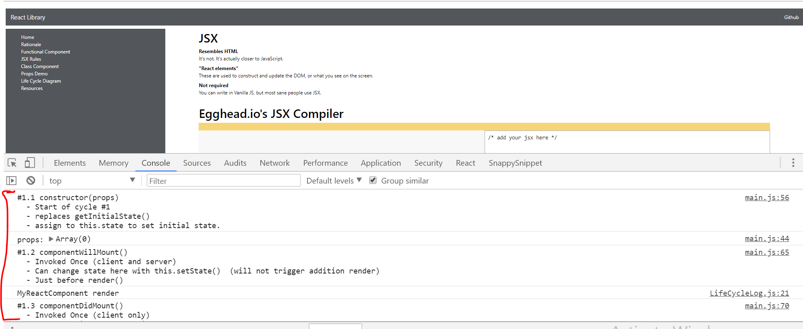

# 7.2: Mounting Methods

A React Component kicks off the life cycle during the initial application ex: ReactDOM.render\(\). With the initialization of the component instance, we start moving through the mounting phase of the life cycle. The biggest focus of the mounting phase is the initial configuration for our Component instance. This is where we pass in the props, configure the default state and get access to the initial UI display. This also starts the mounting process for any children of the Component.

While the entire process of mounting is definitely worth knowing, we're going to get you started on the methods that you'll use most often when writing React applications.

## Common Methods

### componentWillMount\(\) _\*_

The first thing that happens in the mounting phase is the initialization & construction of the component, where the props and initial state are initialized. After this happens, we can start to access `componentWillMount()` and other life cycle methods. This method is called before `render()`.

The `componentWillMount()` method is a great spot to handle configuration since at this point, props and initial state are defined, so we can use this.props and this.state. This means we can start performing calculations or processes based on the prop values. For example, if we want to update our state based on values from props, this would be an ideal place to do that. See the below example for a calculation that would be appropriate to do in `componentWillMount()`. Consider code for a simple weather application:

```javascript
import React, {Component} from 'react';

class Weather extends Component {
  constructor(props) {
    super(props);
    this.state = { weatherIcon: undefined } ;
  }

  componentWillMount() {
    let weatherIcon;
    switch (this.props.weatherDescription) {
        case 'Cloudy':
            weatherIcon = 'day-cloudy'
        case 'Sunny':
            weatherIcon = 'day-sunny'
        case 'Rain':
            weatherIcon = 'day-cloud-rain'
        case 'Snow':
            weatherIcon = 'day-snow'
        default:
            weatherIcon = 'day-partly-cloudy'
    }
        this.setState({ weatherIcon });
  }

  render() {
    return (
      <div>
         <i className= { this.state.weatherIcon }) />
         <p>{ this.props.weatherDescription }</p>
      </div>
    );
  }
}

Weather.defaultProps = { weatherDescription: 'unknown' };

export default Weather;
```

In the above example, in our `componentWillMount()` we make a calculation to determine the appropriate weather icon, based on the prop weatherDescription. This is the best place to make such a calculation because we know we have our state and props ready to go, but our render hasn't been called yet, so we can set these calculations before render, so that they'll be rendered correctly. `componentWillMount()` is the best place to set state based on props. It's also a good place for global events, like connecting a store, or responding to resizing or focus changes.

### render\(\) _\*_

The `render()` method starts in the mounting phase and continues to exist in the update phases. One important thing to note about the `render()` method is all it should be doing is rendering, do not have any calculations or anything in this method that will change the state or props. Do not call `setState()` in `render()`. Doing so will cause the render\(\) method to trigger infinitely, as react re-renders on state change. Luckily, react is great about pointing problems like these out if you do unintentionally do this.

### componentDidMount\(\) _\*_

The last step in the Mount life cycle phase is `componentDidMount()`. This method is called once all of the component's children are mounted. Important to know is that `componentDidMount()` is only called one time. Unlike our other Mount methods, where we start at the top and work down, `componentDidMount()` works from the bottom up, starting from the children components and working upward. So by the time our parent component hits `componentDidMount()` we know that children components have all gone through it as well.

Useful things to do in this life cycle method include:

* **Making API Calls \(this is common and important to remember\)**
* Initializing 3rd party libraries
* Setting up listeners/subscriptions

### Challenge

A helpful means of learning about life cycle components is writing `console.log()` statements inside of the life cycle methods. You can do it like this:

```javascript
class JSXCompiler extends React.Component {
    constructor() {
        super();
        this.state = {
            input: '/* add your jsx here */',
            output: '',
            err: ''
        }
    }
    componentWillMount(){
        console.log("Component will mount");
    }
```

You can also find some logging package that shows off the life cycle methods. We used this [one](https://www.npmjs.com/package/react-log-lifecycle) in our code. This gives us the following effect in our console:



In any case, start to learn the lifecycle methods by finding a way to step through some of the birthing and mounting lifecycle methods in the console so that you can see the order in which they are fired.

[Update Methods](7.3-update-methods.md)

