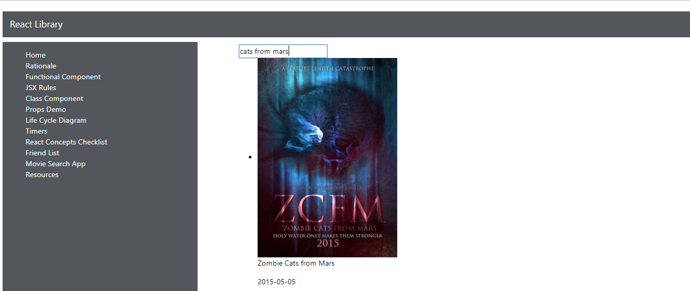

# 5.2 - Form Results Component

In the last section, we set up our Form component, but now we need to create our next component `FormResults`. This component will be where use to display the results from our API query.

Let's just get started by setting up our component. We need to make sure that it's displaying in our app. Go into the `FormResults.js` file. Since we just need this component to display our form results, we're not requiring access to state or anything, we can make this a functional component.

```javascript
import React from 'react';

const FormResults = () => {
    return (
        <h1> Results </h1>
    );
}
export default FormResults;
```

We need to remember to put the props we are sending to this component in, your component should look like this:

```javascript
import React from 'react';

const FormResults = ({results}) => {
    return (
        <h1> Results</h1>
    );
}
export default FormResults;
```

## Results Format

Now that we have our results available to use, we can start working on formatting our results to display them. We can make an unordered list of all of our results, and give it an ID of "results". It's important that this ID is the same because it's used in our parent component. Go ahead and make your return statement look like this one:

```javascript
    return (
        <ul id="results">
            {resultsFormatted}
        </ul>
    );
```

Now, we just need to figure out how to format our results for display! We're going to use map again to take our results and turn them each into a list item with all the information we want. There is a way to grab movie posters for each movie with The Movie Database API, and we're going to use it to display movie posters with our movies! You can read about it in the docs [here](https://developers.themoviedb.org/3/getting-started/images). We're going to take our results and map them into list items with the following things: 1. unique keys 2. an img tag with the movie poster URL 3. the name of the movie 4. the release date

To challenge yourself, see if you can set up this map before looking at the code below. Go through it step by step! This is an example image of what it should look like when done. Scroll down to see the finished code for this component when you're done. Here we show one of Carolyn's favorite movies:



## FormResults

We also need to call the component. Remember that this is a component that we can pass the results to, that will handle displaying them. Go back to the `Form.js` file and make your `render()` look like this:

```javascript
    render() {
        return (
            <form onSubmit={this.handleSubmit} id="form">
                <input onKeyUp={this.handleKeyUp} id="searchInput" className="searchBar" type="text" placeholder="Search a movie" required />
                {this.state.results === [] ? <div></div> : <FormResults results={this.state.results} /> }
            </form>
        );
    }
```

We also need to import `FormResults` so that we can use it. Add the following import line to the top of the file.

```javascript
import FormResults from './FormResults';
```

Next, we're going to talk about a fun way to style react components, called styled-components!!! [Styling our Movie App](5.3-styled-components.md)

## Finished code:

Below is the finished code for this component. If you were able to get anything similar, great job!!

```javascript
import React from 'react';

const FormResults = ({results}) => {
    const link = 'https://image.tmdb.org/t/p/w300';
    const resultsFormatted = results.map((element, index) =>
        <li key={index}>
            
            <div>
                <p>{results[index].title}</p>
                <p>{results[index].release_date}</p>
            </div>
        </li>
        );
    return (
        <ul id="results">
            {resultsFormatted}
        </ul>
    );
}
export default FormResults;
```

## Form Component

Here is `Form.js` with new editions:

```javascript
import React, { Component } from "react";
import FormResults from "./FormResults";

export class Form extends Component {
  constructor(props) {
    super(props);
    this.state = {
      results: []
    };
  }

  handleSubmit = e => {
    e.preventDefault();
  };

  handleKeyUp = (e) => {
    const key = "f8ce157750fba5e5de7193255f318905";

    fetch(
      `https://api.themoviedb.org/3/search/movie?api_key=${key}&language=en-US&query=${e.target.value}&page=1&include_adult=false`
    )
      .then(response => {
        if (response.status !== 200) {
          console.log("Error: " + response.status);
          return;
        }

        response.json().then(data => {
          const results = data.results;
          this.setState({ results });
        });
      })

      .catch(err => {
        console.log("Fetch Error :-S", err);
      });
  };

  render() {
    return (
      <form onSubmit={this.handleSubmit} id="form">
        <input
          onKeyUp={this.handleKeyUp}
          id="searchInput"
          className="searchBar"
          type="text"
          placeholder="Search a movie"
          required
        />
        {this.state.results === [] ? (
          <div />
        ) : (
          <FormResults results={this.state.results} />
        )}
      </form>
    );
  }
}
```

