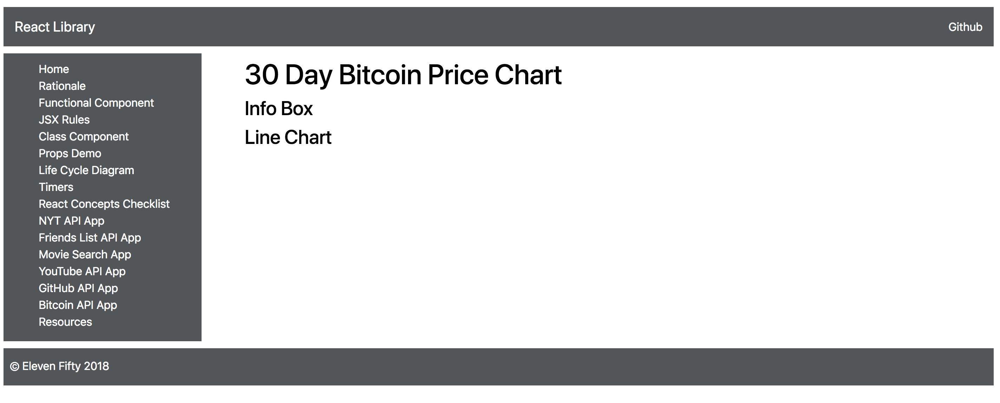

# 8.1 - Bitcoin API Setup

Here, we will set up our React App to see the Bitcoin app, both in the sidebar, as well as in the body.

## Bitcoin.js

First, build out our folder structure. You should build out the structure to look like this:  


```text
    └── src
        └── assets
        └── components
                └── apps
                    └── bitcoin-api-app
                        └── Bitcoin.js
                        └── InfoBox.js
                        └── LineChart.js
```

In your `Bitcoin.js` file, add the following code:  


```text
import React, { Component } from 'react';

export default class Bitcoin extends Component {

  render() {
    return (
      <div className='main'>
        <div className='mainDiv'>
          <h1>30 Day Bitcoin Price Chart</h1>
          <h3>Info Box</h3>
          <h3>Line Chart</h3>
        </div>
      </div>
    );
  }
};
```

This will set us up with a file that is importing React and Component, as well as render for us a basic structure to see what is going on.

## Routes and Sidebar

Next, in your `Sidebar.js` file, set up a route for `Bitcoin.js` and a link to it, linking to `BitcoinApp`.  


Run your React App and you should see this:  




