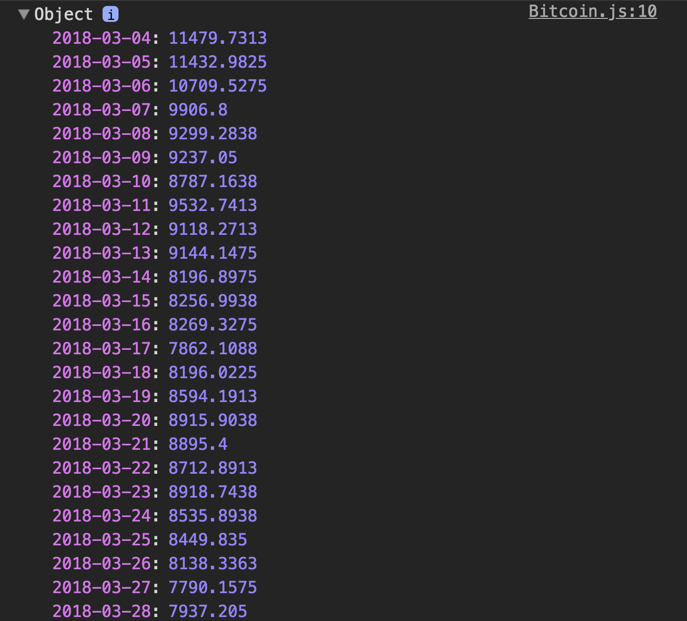

# 8.2 - Bitcoin API Fetch

Next, we need to add the API to our `Bitcoin.js` file. Add this within your `Bitcoin` component above `render()`:  


```text
componentDidMount() {
  const url = 'https://api.coindesk.com/v1/bpi/historical/close.json';
  fetch(url)
    .then(response => response.json())
    .then(bitcoinData => {
      // console.log(bitcoinData.bpi);
      this.setState({
        data: bitcoinData.bpi,
        fetchingData: false
      })
    })
    .catch(e => {
      console.log(e);
    })
}
```

## Analysis

We are fetching the url from coindesk.com that we have declared and getting our two `.then` promises back; first the response, and second, the pertinent data.  


If you uncomment out the `console.log`, you should see something like this when you run it:



This is exactly what we want! This api \(`bitcoinData.bpi`\) gives us both the dates and the payouts of bitcoin; it is simply formatted uniquely. Where, normally, objects would come back with an object with keys that we could call and get the value of, here, we need to collect both the key and the value \(more on that soon\).  


## Constructor

Once, we gather the data, we set the state for both the data and fetching said data. In order to set the state, we need to have the data. So we need to add our constructor above the `componentDidMount`:  


```text
constructor() {
  super();
  this.state = {
    fetchingData: true,
    data: [],
  }
}
```

## Quick Aside

We see `constructor() { super();... }`; before we have seen `constructor(props) { super(props);... }`. Why do we **not** need it here?   


The reality is that the constructor lifecycle method only needs to include `props` within its parentheses when props are actually called within the constructor itself--it is similar to parameters within a function. We only need to include props if the constructor method uses it; otherwise, it assumes props throughout the component and can go unstated. When in doubt, however, feel free to include `props` in the parentheses of your constructor.

## Analysis of the State

Within the state, we see two arguments: `fetchingData: true` and `data: []`. The former is a boolean set to true where it fetches the data; this is helpful if the data is slow-coming. We will see it's point in a second. The latter is an empty array that we will push our fetched data from the API, which we will use in the other two files.

## FetchingData

We see `fetchingData` twice: first in the state, where it is set to `true` \(defaulting to actually gathering the data from the API\), and in the `setState` where it is then set to `false`, showing that, after we fetch the data, we no longer need the `fetch()` to go out and get it.  


Let's make it useful. In your `render()` lifecycle method, adjust your JSX to the following:  


```text
render() {
  return (
    <div className='main'>
      <div className='mainDiv'>
        <h1>30 Day Bitcoin Price Chart</h1>
        { !this.state.fetchingData ? <h3>Info Box</h3> : null }
        { !this.state.fetchingData ? <h3>Line Chart</h3> : null }
      </div>
    </div>
  );
}
```

We are adding two ternaries that holds the two `h3` tags until the data is completely fetched; if it is still fetching, return `null`; otherwise show both `Info Box` and `Line Chart`. You will likely not see much of a difference \(if any\), but if you have a slow connection or a problem with the API itself, this will come in handy.

