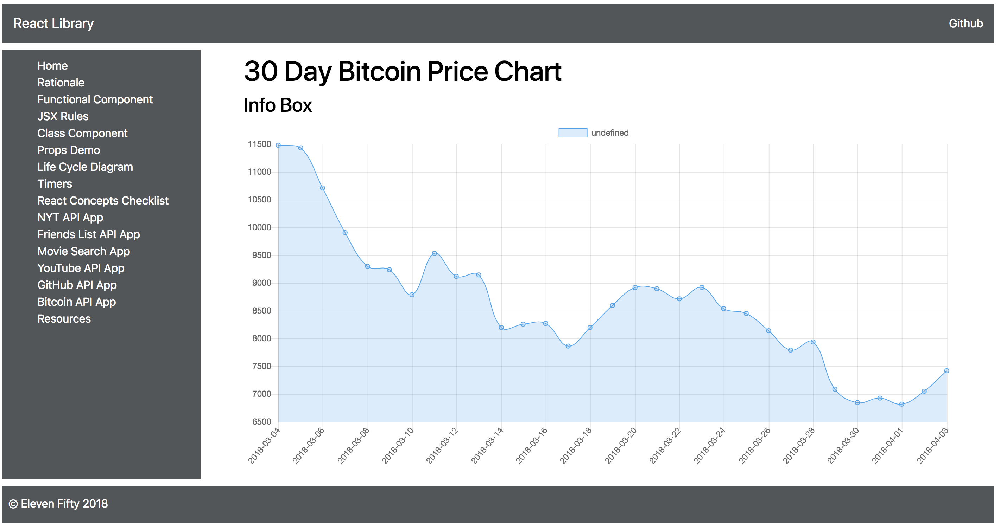
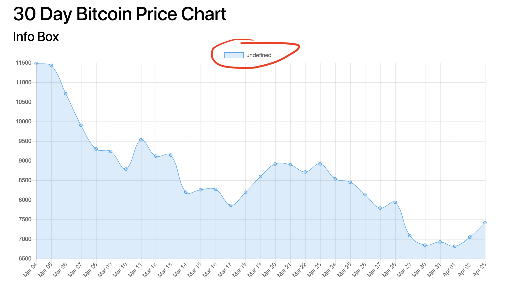
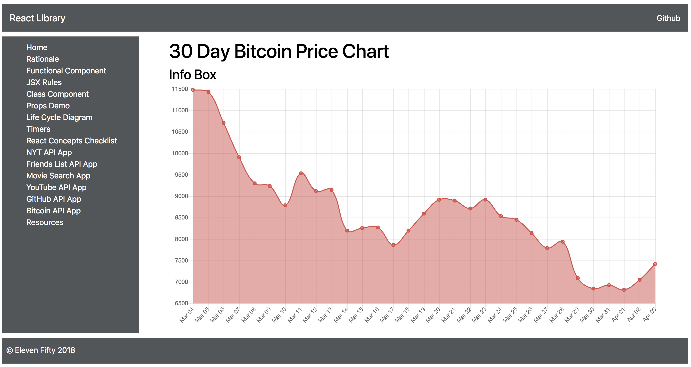

# 8.4 - Bitcoin API Fetching Data

Hard-coded graphs are cool, but let's now add the bitcoin data to see it populate in the chart.  


We first need to bring in our props. In our component, we need to add our constructor:  


```text
  constructor(props) {
    super(props);
  }
```

We are now including our props from our `Bitcoin.js` file. This will bring the data from our `fetch()` that we will use for our graph.  


In a `componentDidMount()` lifecycle method, we need to bring in our data array from the API. Inside your method, add `const unsortedData = this.props.data;`. This pulls the `data` from the state we set in `Bitcoin.js`, hence the `this.props`, which is pointing to the the data from it's parent component.  


Under that, we need to declare two variables, `dates` and `payout` and set both to empty arrays. Next, build a `for in` loop with `let item in unsortedData` within the parentheses. Inside the loop, push `item` to your `dates` array, and push `unsortedData[item]` to your `payout` array.  


Lastly, under your `for in` loop, set the state of `dates` and `payout` to `dates` and `payout`, respectively.  


To make this work, we need to declare the state inside our constructor. Add `this.state ={ dates: [], payout: [] }` under `super(props);`.  


Your code so far should look like this:  


```text
import React, { Component } from 'react';
import Chart from 'chart.js';

export default class LineChart extends Component {
  constructor(props) {
    super(props);
    this.state ={
      dates: [],
      payout: []
    }
  }

  componentDidMount() {
    const unsortedData = this.props.data;
    let dates = [];
    let payout = [];
    for (let item in unsortedData) {
      dates.push(item)
      payout.push(unsortedData[item])
    }
    this.setState({
      dates: dates,
      payout: payout
    })
  }

  componentDidMount() {
    var chartContext = document.getElementById('myChart').getContext('2d');
    var myChart = new Chart(chartContext, {
      type: 'line',
      data: {
        labels: ['first','second','third','fourth'],
        datasets: [{
          data: [1,1,5,0],
          backgroundColor: 'rgba(54, 162, 235, 0.2)', 
          borderColor: 'rgba(54, 162, 235, 1)',
          borderWidth: 1
        }]
      },
      options: {
        scales: {
          yAxis: [{
            ticks: {
              beginAtZero: true
            }
          }]
        }
      }
    });
  }

  render() {
    return (
      <canvas id='myChart'></canvas>
    );
  }
};
```

## Analysis

Our state has two values, `dates` and `payout`. Both are empty arrays. However, why do you also set variables with the same name and datatype inside our `componentDidMount()`? You NEVER want to push data directly to your state! You only want to change your state with `setState()`.  


So, when we declare the two variables and then run a `for in` loop, we push that data into those local arrays in which we then set the state with these newly filled variables into the arrays in our state.

Now, we need to add it to our graph so we can see the data. Replace the array of `labels` from `['first','second','third','fourth']` to `this.state.dates`. Next, replace the array of `data` from `[1,1,5,0]` to `this.state.payout`.

## Quick Aside

What do we notice with both `labels` and `dates`? They are both **arrays**! This is why, declared the variables `dates` and `payout`, we set them as empty **arrays**. We want to bring in the correct data type!

## One Last Thing

This should work, right? Nope. Sorry. There is one last thing we need to do in order to see this data. In your `Bitcoin.js` file, inside your JSX, you should see a ternary with the `<LineChart/>` tag. We need to add our data to that tag. Inside that tag, add this: `data={ this.state.data }`. This pulls the data from our state into this tag and then populates our chart! We should then see this:  




## Make It Look Nice!

There are a couple of things that look a little off that we should now fix!  


First, the dates look bad! Let's fix that. We are going to use something called Moment to adjust the dates so they look like this 'Mar 20' instead of our ugly '2018-03-20'.  


In your terminal where you are running `npm start`, hit `control-c` to stop running the app and then type `npm install --save moment`. Next, import it into your `LineChart.js` file: `import moment from 'moment';`.  


Now we need to actually use it! In your `for in` loop, we are going add `let bitcoinDates = moment(item).format('MMM DD');` above `dates.push(item)`, and then replace `dates.push(item)` with `dates.push(bitcoinDates)` Your `for in` loop should now look like this:  


```text
for (let item in unsortedData) {
  let bitcoinDates = moment(item).format('MMM DD');
  dates.push(bitcoinDates)
  payout.push(unsortedData[item])
}
```

Your chart should now look like this \(but how do we get rid of that dumb legend on the top?\):  




Chart.js has a number features built in that we can manipulate. Under the actual chart, you have an object beginning with `options`. Adjust the object to look like this:  


```text
options: {
  legend: {
    display: false
  },
  scales: {
    yAxis: [{
      ticks: {
        beginAtZero: true
      }
    }]
  }
}
```

Your legend should now be gone.  


Lastly, let's change the line chart itself. It is currently blue, but this is Eleven Fifty, so it should be red! We'll use one of the "official" colors of Eleven Fifty. Let's use that red. Copy the hex color `#d9514e` and replace the two `rgba` colors of the chart so that both are that red color. If you run it, you should see a solid red graph, not a line graph with a pleasant light red underneath. So, for `backgroundColor`, add `80` at the end of the hex \(it should now have 8 digits, instead of 6\). The `80` is the hex color's code for 50% opacity.  


And, finally, let's change the `borderWidth` from `1` to `2`. You should now see this:  




## Challenge

The dates look fine now, but what do we do about the payout? The numbers are not formatted to handled currency. The tricky part is that `data` array of Chart.js only takes an array of numbers; many conversions to currency builds it out as a string. Can you fix it to handled the values but display currency rather than simply numbers?

