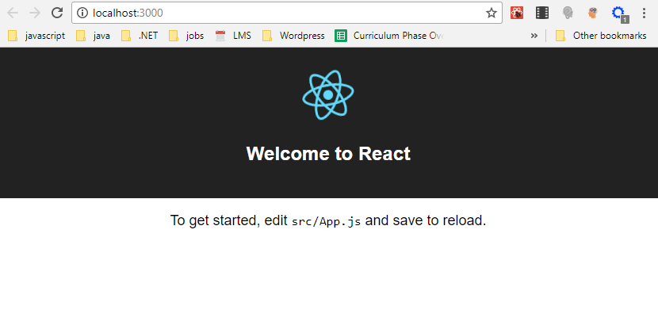

# Getting Started with React

To get started with React, we'll use ```create-react-app```. Starting out with ```create-react-app``` allows us to get started locally with React without having to set up build configurations. ```create-react-app``` works on macOS, Windows, and Linux. We just need to have Node.js installed.

If something doesn’t work, please contact your instructor immediately.

### Get in a directory

Go inside of your project's directory or create a new directory that is not already inside of a git repository. You could call this React-Library. We called ours JavaScript-301-ReactLibrary, but you can just call yours ReactLibrary.

```sh
mkdir ReactLibrary
cd ReactLibrary
```

### Install an instance of ```create-react-app```

Open up the starter app inside of VS Code and open the terminal. We'll now go through the following steps to create your initial app, using Facebook's ```create-react-app``` starter. Note that the `npx` command on the 2nd line is [correct](https://medium.com/@maybekatz/introducing-npx-an-npm-package-runner-55f7d4bd282b). 

```sh
ReactLibrary> npm install -g create-react-app
ReactLibrary> npx create-react-app react-fundamentals
ReactLibrary> cd react-fundamentals
```

Now set up a remote repository on GitHub. Go ahead and capture this initial state of our project.
```sh
git init
git add .
git commit -m "initial commit"
```
Push this to the remote repository like normal.


### Run ```create-react-app``` 

After the app finishes loading, you can run the app locally by using the following command:

```sh
npm start
```

Open [http://localhost:3000](http://localhost:3000) to view it in the browser. You should see the starter app:



Here's Facebook's starter screenshot for more help. Note that they use the generic name `my-app` for their app:
<p align='center'>

</p>


### App Orientation
After creating the application in your terminal, do the following: 
1. Open up the react-fundamentals folder that contains the app.
2. Take a look at the files in the src folder and get an idea of where things are located. By no means do you have to know what is happening right now. Just be aware that for the most part, we'll be working in the <b>src<b> folder. <br />

### Create Directories 
As you open the app, you have a few simple set up tasks:
 
Please right click on the <b>src</b> folder and create 4 folders: 
```
assets
components
constants
styles
```

The project will then have the following structure:

```
react-library
├── README.md
├── node_modules
├── package.json
├── .gitignore
├── public
│   └── favicon.ico
│   └── index.html
│   └── manifest.json
└── src
    └── assets
    └── components
    └── constants
    └── styles
    └── App.css
    └── App.js
    └── App.test.js
    └── index.css
    └── index.js
    └── logo.svg
    └── registerServiceWorker.js
```


### SCSS Setup
Next, we'll get started on setting up SCSS. 

[2 - SCSS-Setup](2-Sass-Setup.md)


