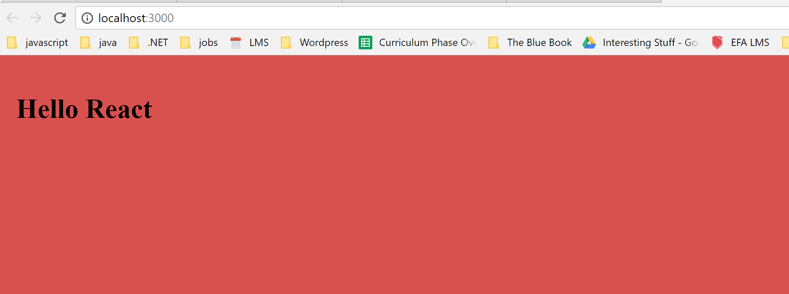
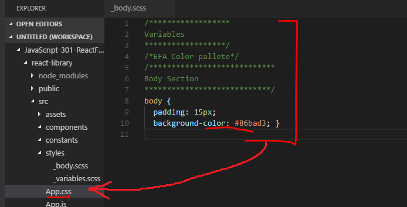

# SASS Setup
Since we're going to use SASS, let's work on setting this up now. This swerves us away from jumping straight into React Fundamentals, but it's just wiser and better to take the time up front to get our environment set up. Let's do it.

### Adding a CSS Preprocessor (SASS, LESS etc.)

Install the command-line interface for SASS. This is recommended by Facebook, and you can read more about it on their ```create-react-app``` starter page.

```sh
npm install --save node-sass-chokidar
```

### Change package.json
In `package.json`, add the following lines to `scripts`. Again, deep understanding is not necessary at this level. Our goal is to get to working with React:

```diff
   "scripts": {
+    "build-css": "node-sass-chokidar --include-path ./src --include-path ./node_modules src/ -o src/",
+    "watch-css": "npm run build-css && node-sass-chokidar --include-path ./src --include-path ./node_modules src/ -o src/ --watch --recursive",
     "start": "react-scripts start",
     "build": "react-scripts build",
     "test": "react-scripts test --env=jsdom",
```

### SCSS File Set up

Follow the steps below closely. If you get lost, refer to the source code for this branch and go back through this a second/third time:
1. In `index.js`, delete the import statement for `index.css`.
2. Delete the `index.css` file. 
3. In `App.js`, delete all of the code in the file and replace it with this code. Go ahead and just copy and paste for now:

  ```js
  import React, { Component } from 'react';
  import './App.css';

  class App extends Component {
    render() {
      return (
        <div>
          <h1>Hello React</h1>
        </div>
      );
    }
  }

  export default App;
  ```
4. Keep the file, but delete all the code from the `App.css`. We will leave the file empty for now. 
5. In the <b>/src</b> folder create an `App.scss` file. 
6. In the <b>/styles</b> folder create two files: `_body.scss` and `_variables.scss`. 
7. In the newly created `styles/_body.scss` file, add the following code:
  ```scss
  /****************************
  Body Section
  ****************************/
  body {
      padding: 15px;
      background-color: $red;
  }
  ```

8. Copy and paste the following starter code to <b>`styles/_variables.scss`</b>. Note that these are the Eleven Fifty colors (you can use your own later)

  ```scss
  /****************** 
  Variables  
  ******************/
  /*EFA Color pallete*/

  $red: #D9514E;
  $orange: #f79569;
  $yellow: #F6D57A;
  $green: #8acfba;
  $blue: #86bad3;
  $blue-green: #9AD0D5;
  $purple: #A992BC;
  $brown: #725b4d;
  $gray: #53565A;
  $black: #000 !default;
  ```

9. In `src/App.scss` add the following imports:

  ```scss
  @import "styles/variables.scss";
  @import "styles/body.scss";
  ```

10. Double check your structure. You should see have the following structure inside the <b>/src</b> folder: 
  ```
  └── src
      └── assets
      └── components
      └── constants
      └── styles
          └── _body.scss
          └── _variables.scss
      └── App.css
      └── App.js
      └── App.scss
      └── App.test.js
      └── index.js
      └── logo.svg
      └── registerServiceWorker.js
  ```


### Compiling the SCSS

Now we'll run `watch-css` to see changes in our SCSS files. Run the following command: 

  ```sh
  npm run watch-css
  ```

Take a look at the `App.css` file. It should be populated with contents of the `_background.scss`. Hit `ctrl + c` to stop the command in the terminal. If you were to run `npm start`, you should see the following on your screen:



Let's make another couple changes. let's change the ```background-color``` to ```$blue```, ```text``` to ```#fff```, and ```font``` to ```Belleza```:
  ```scss
    /****************************
    Body Section
    ****************************/
    body {
      padding: 15px;
      background-color: $blue;
      color: white;
      font: Belleza;
    }
  ```

Run the watch command:
  ```sh
  npm run watch-css
  ```
Stop the command and restart the app with `npm start`. You should see the following:


Go ahead and change the background back to white and the font color to black when you are done checking.
Also, it is important to note that this code is being added to our App.css file, and all of the CSS for the app will be compiled and piplined into that master file.




### Compiling when Running

Having to run `watch-css` then run `npm start` to make CSS changes this way will get obnoxious.  We need to fix our app so that it compiles the SCSS files and runs the `watch-css` automatically with `npm start`, sort of like a standard Gulp file. Here's how to do that:

  ```sh
  npm install --save npm-run-all
  ```

Then, in `package.json` we can change `start` and `build` scripts to include the CSS preprocessor commands:

```diff
   "scripts": {
     "build-css": "node-sass-chokidar src/ -o src/",
     "watch-css": "npm run build-css && node-sass-chokidar src/ -o src/ --watch --recursive",
-    "start": "react-scripts start",
-    "build": "react-scripts build",
+    "start-js": "react-scripts start",
+    "start": "npm-run-all -p watch-css start-js",
+    "build-js": "react-scripts build",
+    "build": "npm-run-all build-css build-js",
     "test": "react-scripts test --env=jsdom",
     "eject": "react-scripts eject"
   }
```

Now when we run `npm start`, it will run the app and bring our SCSS files into our `App.css` file. Try the following:
1. Run `npm start`.
2. Change the background color to $green, while running the app, in the `_body.scss` file.
3. Check the browser to make sure the color changes. 
4. Check the `App.css` file and see that the background color is now green.
5. Change the color back to white.


* [1.3 - npm packages](1.3-npm-packages.md)
